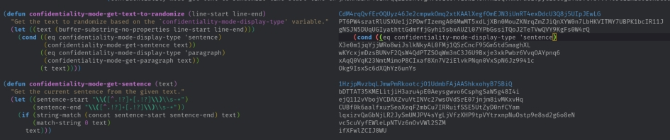

# Confidentiality mode

 This mode is written after several long train rides where I wanted to avoid people looking over my shoulder. I wasn't working on anything confidential but the thought of prying eyes made me feel uncomfortable. I mean, think of all the excellent ideas I may have jotted down that might have been stolen!

 This mode will randomise all text on the screen and only reveal the text in the line/sentence the pointer is on.

 Type away you crazy horses.

 Feedback and comments very much welcome.

## Installation

Clone the repo and add the following to your config:

### Without Melpa
Add the below to your configuration:

`(add-to-list 'load-path "/path/to/folder")`


`(require 'confidentiality-mode)`

### With Melpa
Run the following commands to install

`M-x install-package RET`
`confidentiality-mode RET`

Then add the following to your config

```elisp
(require 'confidentiality-mode)
```


## Usage

Simply envoke the mode to apply it to a buffer.

`M-x confidentiality-mode RET`

# A note on other options

Several other options exist to hide text within emacs buffer. These, however, are based on regular expressions to hide things like passwords or known sensitive information. 

This mode simply obfuscates all text on the screen while retaining the structure of the file, making it easier to navigate and enables the use of the mode without specifying secrets anywhere else. 

This is not a substitute for proper encryption or physical screen protection - consider your application and the data you wish to hide before using any solution.

Do check out [hidepw](https://melpa.org/#/hidepw), [letterbox-mode]( https://melpa.org/#/letterbox-mode), [cloak-mode](https://melpa.org/#/cloak-mode) and [password-mode](https://melpa.org/#/password-mode) for more options.

Similarly, while mode like [Redacted-mode](https://github.com/bkaestner/redacted.el), will replace text on screen with glyphs with Unicode blocks, these options do not allow you to work on the file without toggling the mode on and off. Limiting functionality when actually working on a redacted file.
